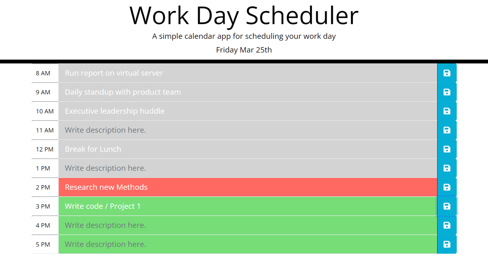

# Single Day Scheduler

# Description

This project is a single day scheduler. Users can add tasks or events to the daily planner to manage their day and time effectivly. 

## About

This project began with HTML and CSS code provided by the UW full stack programming course. Javascript, Moment.js, and JQuery code were added to the project to make the page functional. 

Users can click on a time of the day and enter text to describe the event. The text can be either a title or a short description. The user can then save this by clicking the save icon to the right of the calendered event. 

At the top of the page the current date is shown. As time progresses over the course of the day the background color of each event will change. Events occuring at the current time will have a background of red, upcoming events will be green, and past events will be grey. 

## Appearance

### Single Page Application

## View the project

Navigate to [single_day_scheduler](https://levisgaragegroupinc.github.io/single_day_Scheduler/) to view the live page. 

## Credits

This project uses:

 - Moment.js version 2.29.1 [moment.js.com](https://momentjs.com/) 

 - Bootstrap version 5.1.3 [bootstrap.com](https://getbootstrap.com/)

 - Fontawesome version 5.8.1 [fontawsome.com](https://fontawesome.com/)

 - Google fonts [fonts.google.com](https://fonts.google.com/)
 
 The design colors and layout were provided by the University of Washington full stack programming course. 